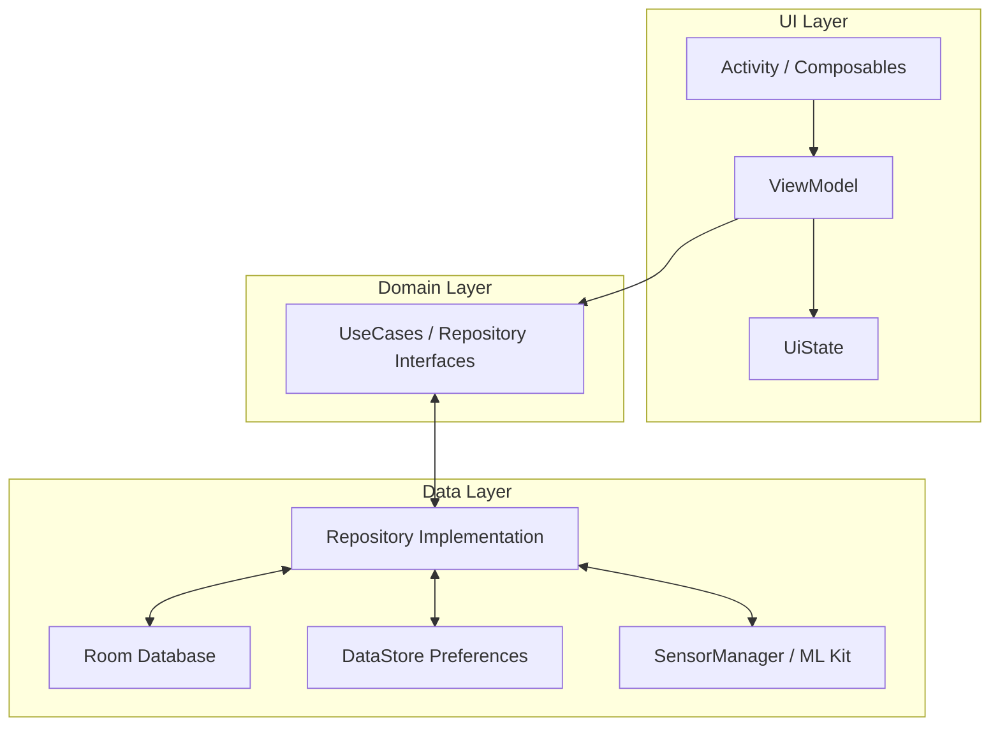

# Android Fitness Tracker

A modern, offline-first Android application for tracking daily steps, logging workouts, and analyzing exercise form using on-device Machine Learning.

## 🚀 Features

*   **Step Tracking**: Background step counting using real-time hardware sensors (accelerometer/step detector).
*   **Exercise Analysis**: AI-powered push-up and sit-up detection using **ML Kit (Pose Detection)** and **CameraX**. Calculates repetitions and provides feedback.
*   **Activity History**: Visualize your progress with weekly, monthly, and yearly charts.
*   **Profile & Settings**: Custom goals, dark/light theme support, and data management.
*   **Social Sharing**: Share your workout achievements with custom-generated milestone cards.

## 🏗️ System Architecture

The application follows strictly typed **Clean Architecture** principles with **MVVM (Model-View-ViewModel)**.

### Technology Stack
*   **Language**: Kotlin
*   **UI**: Jetpack Compose (Material3)
*   **Dependency Injection**: Hilt
*   **Database**: Room (SQLite) with DataStore for preferences
*   **Async**: Coroutines & Flows
*   **Computer Vision**: Google ML Kit (Pose Detection) & CameraX
*   **Charting**: Vico

### High-Level Overview



## 🛠️ How to Launch

### Prerequisites
*   **Android Studio**: Ladybug or newer.
*   **JDK**: Version 17 (recommended) or 11.
*   **Device**: Android 8.0 (Oreo) or higher. Physical device recommended for Camera/Sensor testing.

### Installation Steps
1.  **Clone the Repository**:
    ```bash
    git clone https://github.com/yourusername/fitness-tracker.git
    cd fitness-tracker
    ```
2.  **Open in Android Studio**:
    *   Select "Open" and navigate to the project directory.
    *   Wait for Gradle Sync to complete.
3.  **Build & Run**:
    *   Connect your Android device via USB (ensure USB Debugging is on).
    *   Click the green **Run** button (Shift+F10).

## 📖 User Guide

### 1. Home Dashboard
*   View your daily step count, calories burned, and distance.
*   Start a new workout or view recent activity.

### 2. Exercise Mode
*   Navigate to the **Exercise** tab.
*   Select "Push-ups" or "Sit-ups".
*   **Grant Camera Permission** when prompted.
*   Place the phone on the ground/stand so your full body is visible.
*   Perform the exercise; the app counts valid reps automatically.

### 3. Profile & Settings
*   Tap the **Profile** tab to edit your height, weight, and goals.
*   Click the **Gear Icon** (top-right) to access Settings.
*   Toggle **Dark Mode**, change units, or export your data.

## ⚠️ Troubleshooting

*   **"Camera permission required"**: Go to Android Settings > Apps > Fitness Tracker > Permissions and enable Camera.
*   **Steps not counting**: ensure "Physical Activity" permission is granted and battery saver is not aggressively killing background services.
*   **Crash on Launch**: Uninstall the old version and reinstall to ensure database schemas are fresh (or use the "Reset Data" option if accessible).

## 📜 License
This project is for educational purposes.
