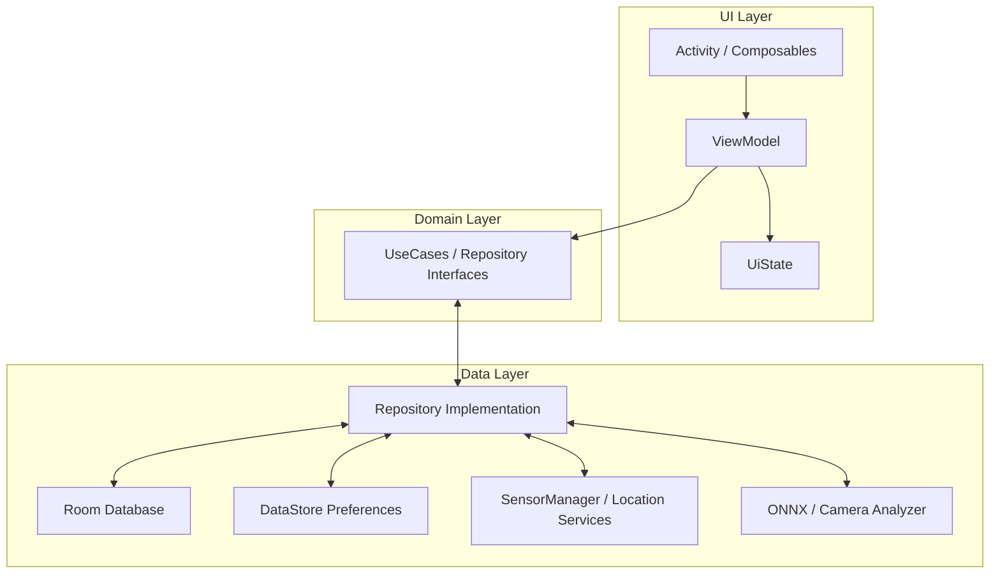

# Android Fitness Tracker

A modern, offline-first Android application for tracking daily steps, logging GPS runs, and analyzing exercise form using on-device Machine Learning.

## 🚀 Features

*   **🏃 GPS Run Tracking**: Real-time run tracking with Google Maps integration. Visualizes your running path, calculates distance, pace, and speed, and displays momentum analytics.
*   **👟 Step Tracking**: Background step counting using real-time hardware sensors (accelerometer/step detector).
*   **🤖 AI Exercise Coach**: Real-time form analysis for Push-ups and Sit-ups using **YOLO26** and **CameraX**. Counts repetitions and provides instant feedback on your form.
*   **📸 Machine Recognition**: Identifies gym equipment using a local **TFLite** model and generates comprehensive usage guides (setup, technique, safety) using **Google Gemini AI**.
*   **📅 Interactive History**: Browse your fitness journey with a custom calendar view. Tap any date to see a detailed breakdown of steps, runs, and workouts.
*   **📊 Weekly Stats**: Visualize your progress with beautiful custom charts and trend analysis.
*   **👤 Profile & Settings**: Personalize your profile and manage goals.

## 🔑 API Configuration (Required)

To use the Map and Location features, you must configure a Google Cloud API Key.

1.  **Create a Project** in the [Google Cloud Console](https://console.cloud.google.com/).
2.  **Enable the following APIs** for your project:
    *   **Maps SDK for Android** (Required for map rendering)
    *   **Geolocation API** (Required for precise location)
    *   **Directions API** (For future route planning features)
    *   **Places API** (For location search and points of interest)
3.  **Generate an API Key**.
4.  **Add the key to your project**:
    *   Open `local.properties` in the project root.
    *   Add the following line (replace `YOUR_KEY` with your actual key):
        ```properties
        MAPS_API_KEY=YOUR_AIzaSy_ACTUAL_API_KEY
        GEMINI_API_KEY=YOUR_AIzaSy_ACTUAL_GEMINI_KEY
        ```

> [!NOTE]
> To use the **Machine Recognition** feature, you need a valid [Google Gemini API Key](https://aistudio.google.com/app/apikey).

## 🏗️ System Architecture

The application follows strictly typed **Clean Architecture** principles with **MVVM (Model-View-ViewModel)**.

### Technology Stack
*   **Language**: Kotlin
*   **UI**: Jetpack Compose (Material3)
*   **Navigation**: Jetpack Navigation Compose
*   **Dependency Injection**: Hilt
*   **Database**: Room (SQLite)
*   **Preferences**: DataStore
*   **Maps**: Google Maps SDK for Android
*   **Computer Vision**: YOLO26 (TensorFlow Lite) & CameraX
*   **Async**: Coroutines & Flows
*   **Image Loading**: Coil

### High-Level Overview



## 🛠️ How to Launch

### Prerequisites
*   **Android Studio**: Ladybug or newer.
*   **JDK**: Version 17 (recommended) or 11.
*   **Device**: Android 10.0 (Q) or higher recommended for full location support.

### Installation Steps
1.  **Clone the Repository**:
    ```bash
    git clone https://github.com/yourusername/fitness-tracker.git
    cd fitness-tracker
    ```
2.  **Open in Android Studio**:
    *   Select "Open" and navigate to the project directory.
    *   Wait for Gradle Sync to complete.
3.  **Build & Run**:
    *   Connect your Android device via USB (ensure USB Debugging is on).
    *   Click the green **Run** button (Shift+F10).

## 📖 User Guide

### 1. Home Dashboard
*   View your daily step count, calories burned, and distance at a glance.

### 2. Start a Run
*   Navigate to the **Run** tab.
*   Grant **Location Permissions** (Precise location is recommended for accurate tracking).
*   Tap **Start**. The map will center on your location and draw your path as you move.
*   View real-time metrics like Pace, Distance, and Duration.
*   **Stop** to save or discard your run.

### 3. AI Exercise Coach
*   Navigate to the **Exercise** tab.
*   Select "Push-ups" or "Sit-ups".
*   **Grant Camera Permission** and place your phone to see your full body.
*   **The AI will detect your pose, count reps, and check your form using YOLO26.**

### 4. Machine Recognition
*   Tap **"Scan Machine"** on the Home Dashboard or Select Exercise screen.
*   Point your camera at a gym machine and snap a photo (or import from gallery).
*   Confirm the machine name.
*   Receive a **detailed AI-generated guide** covering setup, form, breathing, and safety tips.

### 4. History
*   Tap the **History** tab to see your activity log.
*   Use the calendar to filter by date.

## ⚠️ Troubleshooting

*   **"Map is blank"**: Ensure you have added the `MAPS_API_KEY` to `local.properties` and enabled the **Maps SDK for Android** in Google Cloud Console.
*   **"Location not updating"**: Check if "Location" is enabled in your phone's Quick Settings.
*   **"Camera permission required"**: Go to Android Settings > Apps > Fitness Tracker > Permissions and enable Camera.
*   **"API Key missing"**: Ensure `GEMINI_API_KEY` is added to `local.properties` for AI features.
*   **"Labels missing"**: Ensure `app/src/main/assets/labels.txt` exists and matches your TFLite model classes.

## 📜 License
This project is for educational purposes.
